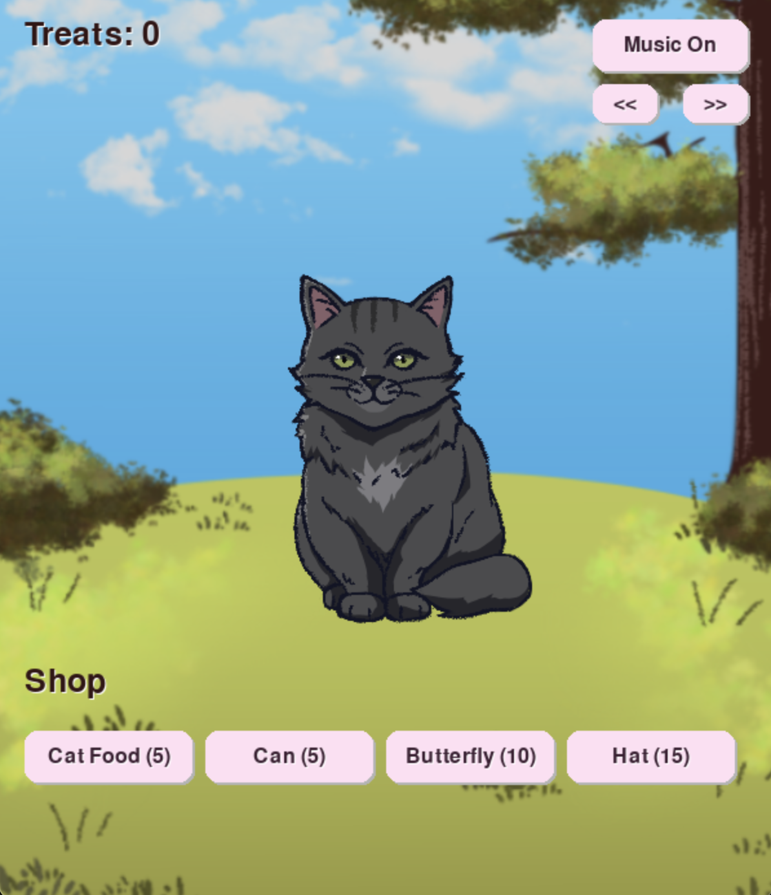
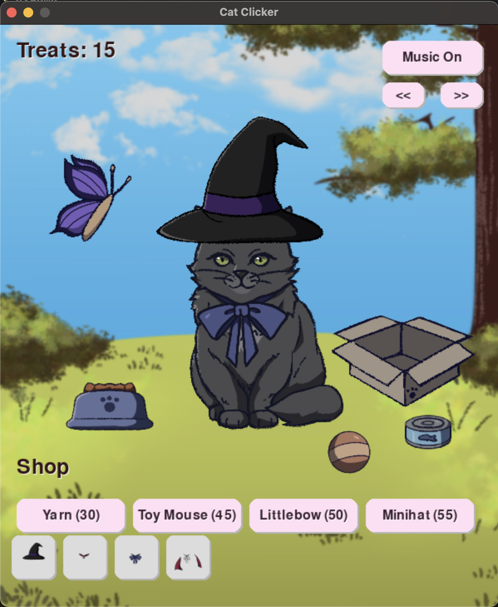

# Cat Clicker 🐱🎀

A small clicker game written in Python with Pygame.  
Click the cat to earn treats, buy decor and outfits, and dress up your cat.

**Everything you see here, from the game code to the original graphics and artwork, was made by me.✨**  




---

## Features

- **Clicker gameplay:** click the cat to collect treats.
- **Shop system:** spend treats to buy decor items or cosmetic accessories.
- **Inventory bar:** shows all purchased accessories as button-style icons - click to equip/unequip.
- **Drag and drop decor:** move purchased décor items around the scene.
- **Background music:** play, pause/unpause, skip tracks.


---
## Requirements

- Python 3.8 or later
- [Pygame](https://www.pygame.org/)

Install dependencies with:  
```bash
    pip install -r requirements.txt
```